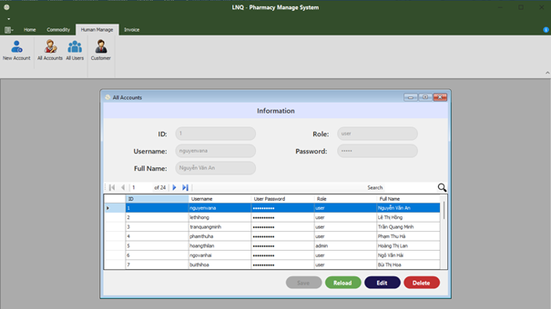

# LNQ - Pharmacy Management System
This project Pharmacy Management is written by .Net (Windows Form)
### Technical requires
- C# .NET Framework 4.7
- DevExpress for Winform v24.1
- Guna.UI2.Winform Framework 4.6
- MSSQL Server (others might not work properly)
----
### Features
**User role identity**
The software employs a role-based identity system for user management. The Admin role has exclusive permissions to create new user accounts and assign roles to them. Other roles, created by the Admin, are restricted to managing pharmacy commodities and updating their personal information.
- Login as admin: 
In the database, an account with admin privileges has been provided. We use the account of Hoang Thi Lan with the username “hoangthilan” and the password “12345”.

1. Profile:

2. New user:

3. All accounts:

4. All users:
