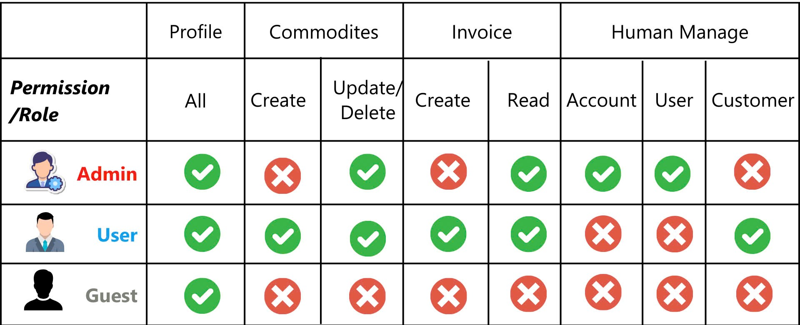
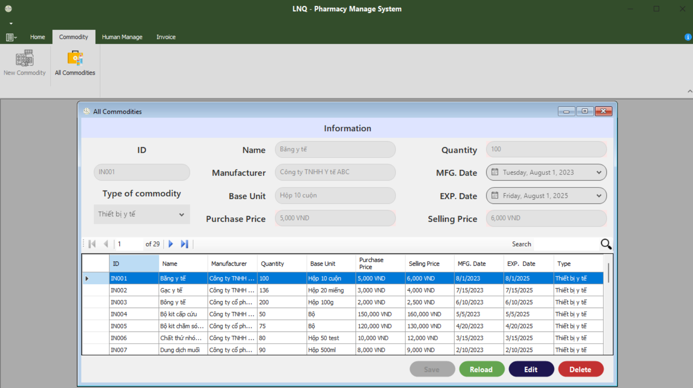
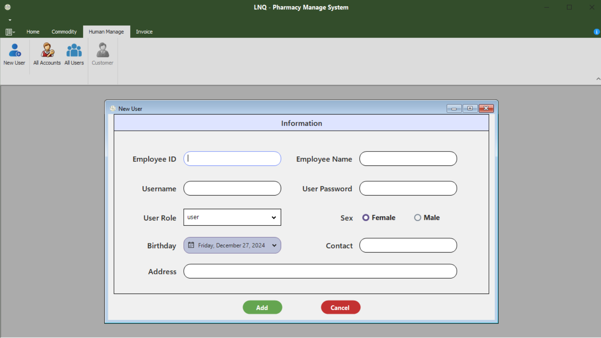
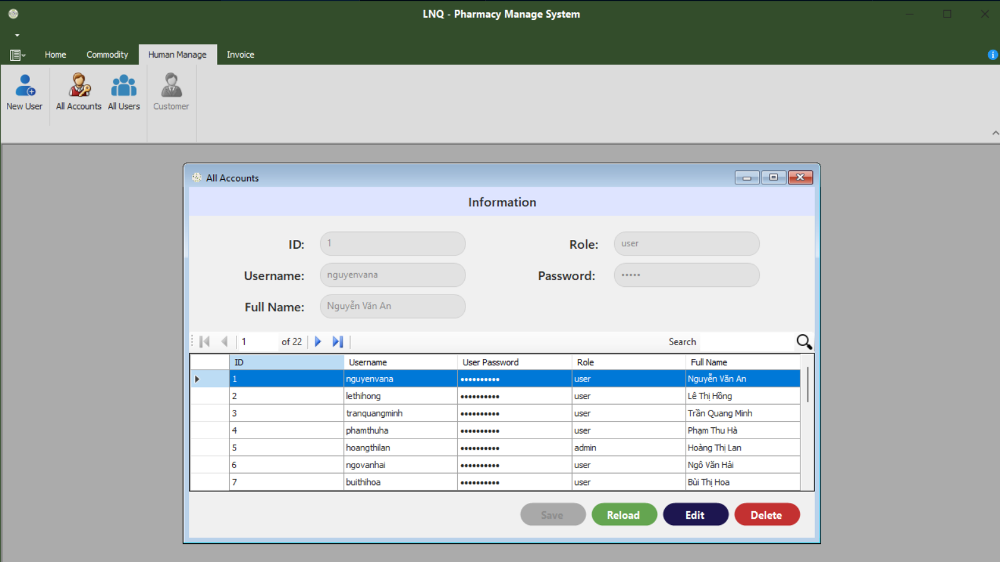
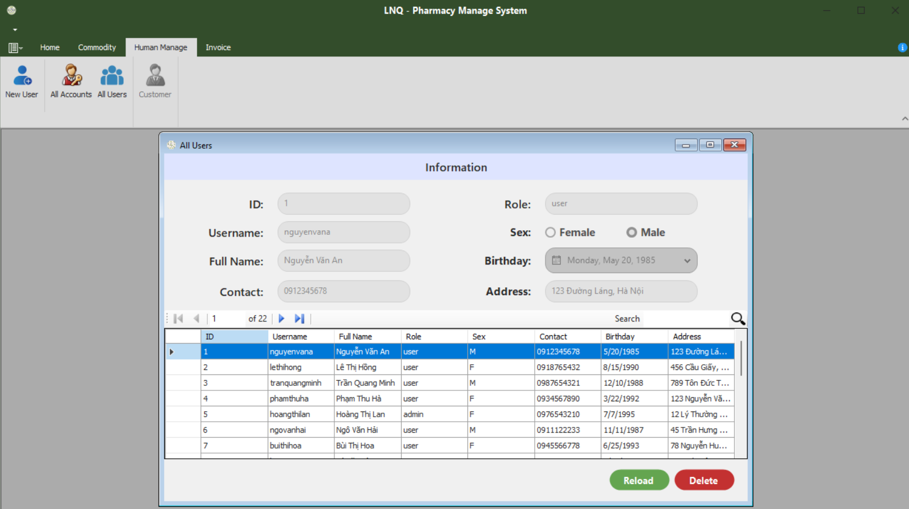

# LNQ - Pharmacy Management System

This project, **Pharmacy Management**, is developed using .NET (Windows Forms).

---

## Technical Requirements
- **C# .NET Framework 4.7**
- **DevExpress for WinForms v24.1**
- **Guna.UI2.WinForm Framework 4.6**
- **MSSQL Server** (other database servers might not function properly)

---

## Database Setup
To install the database for the Pharmacy Management System, follow these steps:

### 1. Locate the Project Folder
- Right-click on the `PharmacyManagement` project.
- Select **Open Folder in File Explorer** from the context menu.

### 2. Navigate to the Database Query Folder
- Open the folder named `DB-Query`.
- Inside, locate the `PharmacyMgtSys` folder.

### 3. Run the Database Script
- Execute the `PharmacyMgtSys.sql` file to complete the database setup.

---

## Features

### User Role Identity
The software employs a role-based identity system for managing users. The **Admin** role has exclusive permissions to:
- Create new user accounts.
- Assign roles to users.

Other roles, created by the Admin, are limited to:
- Managing pharmacy commodities.
- Updating their personal information.

### Admin Login
In the database, an admin account has been pre-configured with the following credentials:
- **Username:** `hoangthilan`
- **Password:** `12345`

### Key Functionalities

### Permission role

#### 1. Profile Management
View and update user profile information.

#### 2. Manage All Commodities
View and delete commodity

#### 3. Manage Human
- Admins can create new user accounts.

- Admins can view and manage all user accounts.

- Admins can access and update user details.

#### 4. Manage Invoice
- Admins can view all invoices of users

---